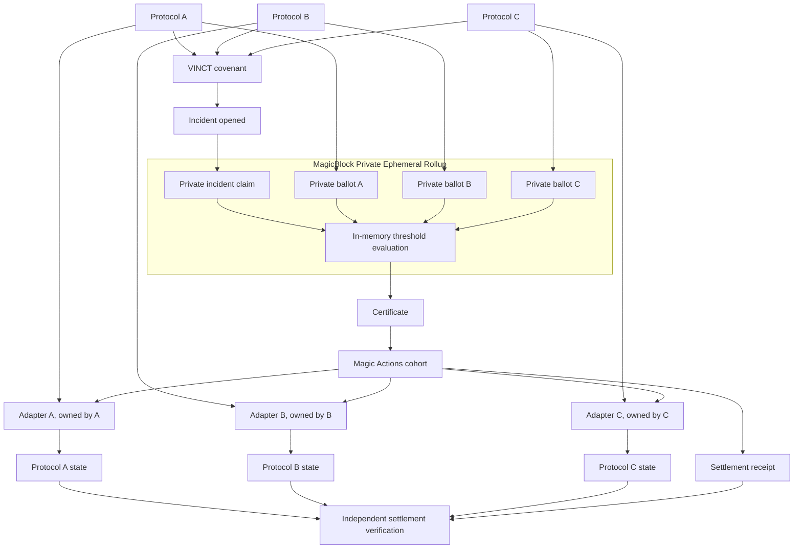

# VINCT

Binding mutual aid for protocols.

Protocols that depend on the same oracle or bridge agree in advance on exactly what each will do
in an emergency, decide privately whether it is happening, and act together. Nobody hands anybody
else authority.

**[Live app](https://vinct.timjosh507.workers.dev)** ·
**[90-second demo](https://vinct.timjosh507.workers.dev/demo)** ·
**[Verify a settlement](https://vinct.timjosh507.workers.dev/proof)** ·
**[Service status](https://vinct.timjosh507.workers.dev/status)**

Running on Solana Devnet against MagicBlock's public rollups. The demo and the verifier need no
wallet.

## The problem

Protocols rarely fail alone. They share a price feed, a bridge, a wrapped asset, an RPC provider.
When that dependency breaks, everyone exposed to it has the same few minutes and the same short
list of things worth doing.

What actually happens in those minutes is informal. Someone notices. A group chat forms, or three
separate ones do. Teams compare exposure over DMs, try to work out whether this is real or a bad
tick, hunt down whoever holds a multisig key, write emergency transactions by hand, execute them
in whatever order people wake up in, and reconstruct the timeline afterwards from screenshots.

The coordination is improvised. The consequences are on-chain and permanent.

The obvious fixes do not work. A shared multisig asks every protocol to hand authority over its
own contracts to a group, and no serious protocol will do that. A shared on-chain vote leaks:
any account holding a running tally can be read by anyone who can touch it, and "two of three
have already voted to pause" is a tradeable fact before the third has decided.

So the agreement that would help has to be made before the crisis, has to leave every protocol
holding its own keys, and has to stay unreadable while it is being made.

## The VINCT model

Protocols form a covenant while nothing is wrong.

Each protocol, acting alone with its own authority:

- ratifies its own participation
- deploys and owns its own adapter, which no one else can install or arm
- arms exactly one bounded action against its own contracts: one instruction, one account it may
  touch, one effect ceiling, one validity window

The covenant freezes the member set, the policy, the threshold, and every adapter version. None
of it can move once an incident opens.

When the dependency fails:

- a member opens an incident, and the claim and its evidence go into an account inside a
  MagicBlock Private Ephemeral Rollup that only the member set can read
- every member gets their own ballot account, readable by exactly one key
- members answer privately, and cannot see each other's ballots
- no account anywhere holds a running count while the incident collects
- the program counts ballots in memory during certification, and if the threshold is met the
  incident earns a certificate
- Magic Actions schedules the bounded adapter cohort plus a settlement receipt
- each protocol's own adapter reads the certificate, revalidates it against the bounds that
  protocol set beforehand, and acts or refuses
- VINCT then reads every effect back off the base layer, one at a time, before calling anything
  settled

A certificate carries no authority and grants none. It is a published fact. A protocol can
suspend its adapter at any moment, including after certification, and the adapter still refuses.

## Why MagicBlock is load-bearing

Three mechanisms, each doing work the base layer cannot.

### Private Ephemeral Rollups

The sealed quorum depends on a property we established by experiment rather than assumed:
**program execution authorization and query visibility are separate.**

A member can send a transaction that makes the program read and mutate accounts that same member
cannot read over RPC. If permissions had gated execution instead, every voting member would have
to be inside the aggregate's permission, and would therefore be able to read the live tally and
every peer's ballot. The whole design would collapse into a public vote.

We tested it on the TEE-backed Devnet PER at `devnet-tee.magicblock.app`, validator
`MTEWGuqxUpYZGFJQcp8tLN7x5v9BSeoFHYWQQ3n3xzo`, with a standalone probe program. Two members, two
ballots, one aggregate:

| Read attempt | Result |
| --- | --- |
| member reads their own ballot | readable, 51 bytes |
| member reads the other member's ballot | the rollup returned no account |
| member reads the aggregate | the rollup returned no account |
| the fee payer reads either | the rollup returned no account |
| an anonymous caller reads either | the rollup returned no account |

Both members cast successfully and the program's arithmetic was correct, so execution worked
while every cross-member read failed. Recorded as `EXECUTION_IS_NOT_QUERY_AUTHORIZATION` in
[artifacts/devnet/per-visibility-experiment-latest.json](artifacts/devnet/per-visibility-experiment-latest.json).
That is the finding the split-account ballot model rests on.

### Magic Actions

Magic Actions carries the bounded adapter cohort: three protocol adapters and a settlement
receipt, linked to the commit.

The important part is what we do not assume. An ER scheduling signature means an intent was
accepted. It does not mean anything ran.

We proved that by breaking one action on purpose. On a local MagicBlock stack
(`ephemeral-validator` 0.13.19, committor `ComtrB2KEaWgXsW1dhr1xYL4Ht4Bjj3gXnnL6KMdABq`), a
four-action cohort was scheduled with only protocol gamma's action malformed: gamma's own
authority had never registered an adapter signer, so gamma's protocol refused the pause with
`0x1770 NoAdapterRegistered`.

The committor logged `Patched intent: 2. error was: User supplied actions are ill-formed` and the
scrubbed checkpoint reached the base layer. Alpha's and beta's actions were well-formed and
independent. **Neither of them ran.** Zero of three adapters applied, no settlement receipt, and
the commit landed anyway.

One malformed action removed the whole cohort. That is why `COMMIT_WITHOUT_ACTIONS` is a
first-class state in VINCT rather than an error path, why every effect is observed individually
off base-layer account state, and why a half-applied cohort blocks automated recovery outright
instead of retrying a single missing action.

Reproduced on Devnet as operation
[`91e8cd15…`](https://vinct.timjosh507.workers.dev/proof/91e8cd15e8b57279ed6ce6ab95a9614348dc8d5041ff4d7a7b79e2bfcf4bd9a1),
classified `COMMIT_WITHOUT_ACTIONS`, ER signature `2kqX3ewr…`, zero adapters applied.

One limitation, stated in the artifact itself: whether all four actions shared a single
transaction strategy is not directly observable from account state. The classification records
what landed, not how it was grouped. The committor log above is the local-stack evidence for the
grouping.

### Cranks

An incident that nobody answers cannot stay open forever waiting for a quorum that is not coming.
A crank runs the expiry schedule inside the rollup.

Both paths pass on Devnet:

| Run | Task | Outcome |
| --- | --- | --- |
| expiry | `7712133553396474458` | `DESIRED_STATE_REACHED`, settled by the scheduler, scrub verified on base |
| cancellation | `5588915819461510815` | `REMOVAL_OBSERVED`, iterations stopped, scrub verified on base |

Limitation, recorded in both artifacts: this validator exposes no task registry, so registration
is inferred from an observed execution rather than read directly.

### The removal test

Take MagicBlock out and VINCT is not a smaller version of itself. It stops being the thing:

- **No private incident boundary.** The claim and every ballot become public accounts. Members
  read each other's votes and the running tally, so the sealed quorum is gone and the vote leaks
  before it completes.
- **No tested cohort execution model.** The bounded adapter set has no commit-linked way to
  execute together, and the failure behaviour that shaped the whole settlement design does not
  exist to be discovered.
- **No settlement model to reconcile against.** `COMMIT_WITHOUT_ACTIONS` is a MagicBlock
  committor behaviour. Without it there is nothing to observe, classify, or recover from.

The router matters too. Scripts resolve the rollup through `getDelegationStatus`, which returned
`https://devnet-eu.magicblock.app/` for the delegated operation account rather than any endpoint
we chose. The frontend carries one regional default in
[network.ts](apps/web/src/lib/network.ts) as a first candidate, then adds every route the router
advertises and picks whichever one is executing the current build fingerprint. Reachability is
not the test, and no endpoint is selected by its hostname.

## Architecture



Nothing crosses from the PER box to a protocol's state without passing through an adapter that
protocol owns. The full picture, without reading code, is in
[docs/ARCHITECTURE.md](docs/ARCHITECTURE.md).

## What is private, and what is not

**Public:** that an incident exists, its threshold and window, its terminal outcome and final
counts, and all settlement evidence.

**Private to the member set:** the claim and its evidence.

**Private to one member:** that member's decision. Not the decision, not whether they answered,
not when, and not to the opener, the steward, or the other members either.

While an incident collects, no account anywhere holds a count. The tally exists only inside
certification, for the moment it runs.

What is deliberately not claimed is in [docs/PRIVACY_MODEL.md](docs/PRIVACY_MODEL.md).

## What authority VINCT has

None.

There is no instruction anywhere that gives the circle, the steward, or any VINCT program the
ability to act on a member's contracts. An adapter reads a certificate, revalidates it against
bounds its own protocol set before any incident existed, and decides for itself.

## How settlement is verified

Check any operation yourself at
[vinct.timjosh507.workers.dev/proof](https://vinct.timjosh507.workers.dev/proof). No wallet, no
login. Seventeen checks, read from Devnet, re-deriving the operation identity from the covenant's
own frozen terms with an implementation that shares no code with the on-chain program.

| | |
| --- | --- |
| A settlement that landed | [`b259584f…`](https://vinct.timjosh507.workers.dev/proof/b259584f4498acbc356d1940865288b623f4049e155b73c574dad7d4d166af1a) |
| One that was scheduled and stripped | [`91e8cd15…`](https://vinct.timjosh507.workers.dev/proof/91e8cd15e8b57279ed6ce6ab95a9614348dc8d5041ff4d7a7b79e2bfcf4bd9a1) |

## Quick judge path

About 90 seconds, no wallet:

1. [vinct.timjosh507.workers.dev](https://vinct.timjosh507.workers.dev), read the one sentence
2. **Explore live demo**: three protocols, one dependency, a real recorded incident
3. Step through the seven stages
4. Switch to **Nothing executed**: the scheduled cohort that did nothing, and VINCT saying so
5. **Verify this operation yourself**

Full script with what to say: [docs/DEMO_GUIDE.md](docs/DEMO_GUIDE.md).

## Programs

Solana Devnet, deployer and upgrade authority
`2Mz8wsdCor431yjZ46wRaKF8ZjoTYPC5nxNNqFR7PWBU`.

| Program | Address |
| --- | --- |
| `vinct_core` | `9BaZmGntudyAL5VodBWFCANchn7vx1Y7DNpXADbx6JcG` |
| `vinct_adapter` | `2BoSGgPxcpS2NcKGK9ygJdRfcfL6gYeDgh4QRGrujBM4` |
| `vinct_mock_protocol` | `BDUybXDdLCCbnCjthbs9NATmYZWTTKxCzqejyqyvzorS` |

Deploy signatures and the executable verification are in
[artifacts/devnet/deployment.json](artifacts/devnet/deployment.json).

## For reviewers

In this order:

1. This file
2. [docs/ARCHITECTURE.md](docs/ARCHITECTURE.md), the system without reading the codebase
3. [docs/SECURITY_MODEL.md](docs/SECURITY_MODEL.md), trust boundaries and the failures that shaped them
4. [docs/PRIVACY_MODEL.md](docs/PRIVACY_MODEL.md), exactly what is hidden from whom
5. [docs/claim-ledger.json](docs/claim-ledger.json), every claim with its evidence and limits
6. [docs/decision-log.md](docs/decision-log.md), why each decision was made, with the evidence
7. `programs/`, starting with `vinct-core` then `vinct-adapter`
8. `crates/vinct-reference`, the executable model the programs are checked against

[docs/audit-report.md](docs/audit-report.md) lists what we got wrong and the gate each mistake
left behind. [docs/KNOWN_LIMITATIONS.md](docs/KNOWN_LIMITATIONS.md) is explicit about what is
still not proven.

## Local development

Needs `rustup`, `avm`, Node 22+, `pnpm`, and a Solana CLI to bootstrap from. The project pins its
own Solana release under `.toolchain/` and leaves the machine-wide one alone.

```bash
bash scripts/bootstrap-toolchain.sh
pnpm install --frozen-lockfile
cp apps/web/.env.example apps/web/.env.development.local
pnpm web                     # the app, against Devnet, on http://localhost:5173
```

The copy is not optional. A deployment reads the chain through `/rpc` on its own origin, which is
the Cloudflare Worker holding the upstream credential, and `vite` serves no such route. Skip the
copy and every read 404s while the pages still render, so the console reports an empty chain
rather than a missing endpoint. `.env.development.local` names a public Devnet endpoint directly,
and the dev server says so on screen if the file is missing.

The `.development` in that filename is load-bearing. Vite reads `.env.local` in every mode,
production builds included, so the same values parked there would quietly replace the Worker
proxy in a deployed bundle. A production build warns if `VITE_SOLANA_RPC` is set at all.

The whole mechanism, end to end, on a local MagicBlock stack:

```bash
bash scripts/bootstrap-local.sh start
pnpm exec tsx scripts/phase5-composition.ts                # settles
pnpm exec tsx scripts/phase5-composition.ts --suspend-one  # a protocol pulls out late
pnpm exec tsx scripts/phase6-expiry.ts                     # nobody answers; the crank settles it
```

## Tests

```bash
cargo test --workspace       # 323 Rust tests
pnpm test:ts                 # 77 TypeScript tests
pnpm exec playwright test    # browser, desktop and mobile
pnpm audit-claims            # 64 claims, each stamped and bounded
pnpm scan-artifacts          # no credential or private material committed
```

Everything in [docs/VERIFICATION.md](docs/VERIFICATION.md).

## Claims

[docs/claim-ledger.json](docs/claim-ledger.json) records every public claim with its proof level,
the network it was verified on, the commands that produced it, and its limitations. Of the 64
claims, 15 are verified on Devnet, 13 on a local MagicBlock stack, 11 under LiteSVM, 9 on
localnet, and 16 are statements about the repository itself that need no network.

A claim never outruns the evidence recorded beside it, and `pnpm audit-claims` enforces that
mechanically.

## License

[MIT](LICENSE). Security reporting in [SECURITY.md](SECURITY.md).
