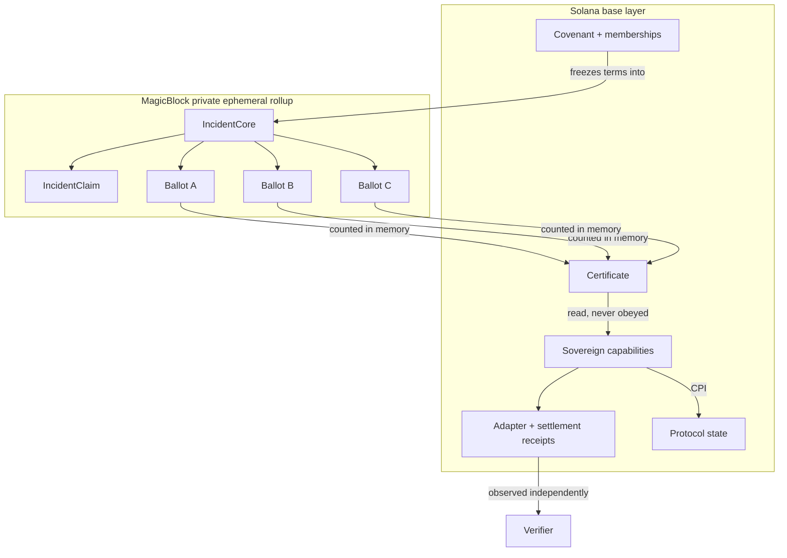
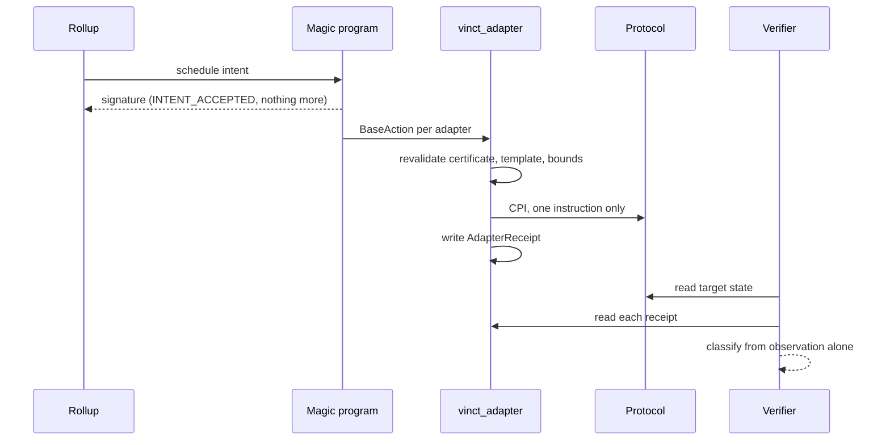
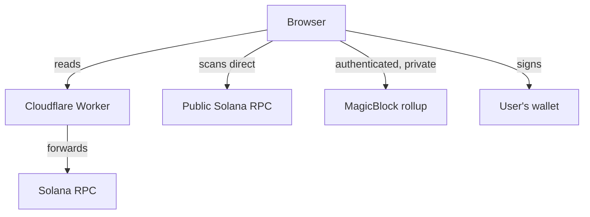

# Architecture

Enough to understand VINCT without reading the codebase, in the order the system actually runs.

## The shape of it

Three protocols share a dependency. They agree in advance on what each will do if it fails,
decide privately whether it has failed, and each acts through an adapter it owns. Nothing in
VINCT can make a protocol act.



## Covenant formation

A covenant is the agreement, and no single key can produce one.

| Step | Signed by | What it grants |
| --- | --- | --- |
| `create_covenant` | steward | nothing; an empty covenant exists |
| `add_covenant_member` | steward | nothing; names a candidate |
| `ratify_covenant_member` | that protocol | its own consent, only |
| `arm_covenant_member` | that protocol | records that it armed its own adapter |
| `ratify_covenant` | nobody | freezes the member set commitment |
| `arm_covenant` | nobody | opens the covenant for incidents |

The last two take no signature because by the time they run every signature that mattered has
been given, and they refuse unless that is true. Making them permissionless removes a place for
somebody to sit on a result the members already reached.

Ratification computes `member_set_hash` on chain over a strictly ascending member list. That one
digest is what every later incident is bound to.

## Sovereign capability

A capability is a bound a protocol places on itself, installed and armed with its own key,
before any incident exists.

It commits to: the target program, one instruction discriminator, the exact instruction data, an
effect ceiling, a validity window, the covenant, the epoch, the policy, the frozen member set,
the cluster, and an **action template**.

### ActionTemplateV1

The template commits to the *shape* of the instruction rather than to a concrete transaction.
Each account slot carries a role from a closed enum: `Fixed` with an address, or `Certificate`
and `AdapterReceipt` which carry no address at all.

That indirection is the point. A receipt's address is seeded by an operation ID that does not
exist until an incident certifies, so a template naming it could only be built after the
incident it was meant to authorise. Roles let a protocol arm once and stay armed for every
incident the covenant ever certifies. See [decision-log.md](decision-log.md) D-0048 and D-0050.

There is no seed recipe a client can supply. A template that let a caller describe how to derive
an account would be a forwarding surface wearing a commitment.

## Incident state, split three ways

| Account | Lives | Readable by |
| --- | --- | --- |
| `IncidentCore` | base, then delegated | everyone |
| `IncidentClaim` | rollup | the member set |
| `MemberAttestation` | rollup, one per member | that member alone |

The split is the privacy model. A single account holding claim and ballots would be readable by
anyone permitted to touch it, and a permission that lets a member write also lets them read.

`IncidentCore` carries the frozen snapshot copied from the covenant at creation: threshold,
window, policy, member set hash, template hash, cluster, epoch. The opener supplies none of it,
which is what stops whoever opens an incident from choosing the answer.

Every ballot account is created **before** the incident opens, for every member, whether or not
they ever answer. An account appearing on first vote would announce that somebody had voted.

## Private certification

Members submit sealed attestations inside the rollup. `certify_incident` then:

1. reconstructs the ballot set from `remaining_accounts` rather than trusting it,
2. checks every ballot's owner, schema version, incident binding, and canonical address,
3. requires members strictly ascending,
4. recomputes `member_set_commitment` and requires it to equal the frozen one,
5. tallies in memory,
6. writes only the final counts, and only once terminal.

No account holds a running tally at any point. There is nothing to leak even to somebody who
could read everything.

## operation_id

```
sha256(
  domain("VINCT_OPERATION_V1")
  || cluster_genesis_hash || covenant || circle_epoch_le64 || incident_id_le64
  || policy_id || member_set_hash || action_bundle_template_hash
  || certificate_nonce_le64
)
```

Derived from the frozen snapshot and the certification slot. It commits to the *template* hash
rather than the concrete bundle, because the bundle's receipt addresses are seeded by the
operation ID and cannot also be an input to it. See D-0012.

## Certificate

`publish_certificate` takes no arguments. Every field comes from the released core, and
`issuing_authority` is the incident's own address. There is no key that can produce a
certificate; only an incident that reached its covenant's threshold. Publishing is
permissionless for the same reason the covenant-level steps are.

## Settlement

The scheduled cohort is three adapter actions plus one settlement receipt, in one Magic Action
intent.



`vinct_adapter` revalidates everything before acting: covenant, epoch, policy, member set,
cluster, certificate expiry, the operation ID, the re-derived certificate address, its own
template hash rebuilt from the live account list, the instruction data hash, the effect ceiling,
armed and suspended state, the validity window, and replay via the receipt.

Injected escrow accounts are excluded from the commitment deliberately, which is what lets one
arming serve both a direct call and a scheduled action.

### The classifier

| Classification | Requires |
| --- | --- |
| `AllActionsApplied` | settlement receipt present and every action's receipt *and* target effect present |
| `CommitWithoutActions` | checkpoint present, settlement absent, every action positively absent |
| `PartialObservation` | anything mixed |
| `Unknown` | anything unreadable |

`NotObserved` and `Absent` are different values. Collapsing them turns an RPC outage into a false
`CommitWithoutActions` and then into a recovery nobody needed.

There is deliberately no branch treating "most effects applied" as success.

## Cranks

`request_expiry_crank` builds the inner `expire_incident` instruction **inside the program** and
schedules it. A caller supplies cadence and nothing else: an instruction accepting a caller's
instruction would let anyone schedule arbitrary work under VINCT's identity.

The task ID is a domain-separated digest of cluster, covenant, and incident, so no two incidents
collide and re-requesting lands on the same task rather than creating a second.

`expire_incident` is idempotent and monotonic, and returns `Ok` on every reason not to act. A
scheduler receiving an error would retry work that is already finished.

## Recovery

Only `CommitWithoutActions` permits a proposal. `PartialObservation` blocks it: a half-applied
cohort means an assumption about transaction-strategy grouping was wrong, and automating a retry
before somebody understands why is how a bounded action becomes unbounded.

A recovery draws a new operation ID from a fresh nonce. An adapter that consumed the original
still refuses it; one that did not will accept exactly one of the two.

## Frontend and verifier

`apps/web` is a static React app. It reads chain state directly, builds every transaction in the
browser, and holds no key. Two frames: public routes need no wallet, `/app/*` is the operator
console.

`packages/verifier` re-derives an operation ID from the covenant's own frozen terms using an
implementation that shares no code with the program, then confirms every account carries it. Its
agreement means something precisely because it is a second implementation.

Verification and delivery are reported separately. A cohort that was scheduled and stripped has
correctly bound receipts and no effects, so folding them together would let a verified identity
read as a completed settlement. See D-0058.

## Deployment boundary



The Worker serves static assets and forwards a fixed allowlist of read methods, so a paid RPC
credential stays server-side. It holds no authority, signs nothing, stores nothing, and never
sees private incident material: that path runs from the browser straight to MagicBlock over a
wallet-authenticated connection.

If the Worker disappeared the app would still work against any RPC a reader names with `?base=`.
There is no database.

---

**Next:** [SECURITY_MODEL.md](SECURITY_MODEL.md) for the trust boundaries this shape enforces,
[PRIVACY_MODEL.md](PRIVACY_MODEL.md) for what each party can read, and
[decision-log.md](decision-log.md) for why any given piece is the way it is.
[Back to the README](../README.md).
